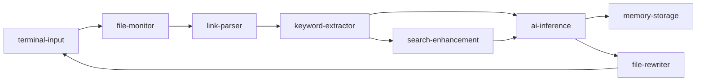

# Cognitive Weaver MOFA 版本

基于MOFA框架的Cognitive Weaver智能知识图谱构建系统。

## 🎯 项目概述

Cognitive Weaver是一个AI驱动的Obsidian知识图谱结构化引擎，现已迁移到MOFA框架，具备更强的扩展性和组合能力。

## 🏗️ 架构设计

### Agent组件

| Agent | 功能 | 状态 |
|-------|------|------|
| `cognitive-weaver-file-monitor` | 监控Markdown文件变化 | ✅ 已完成 |
| `cognitive-weaver-link-parser` | 解析双链链接 | ✅ 已完成 |
| `cognitive-weaver-keyword-extractor` | 提取关键概念 | ✅ 已完成 |
| `cognitive-weaver-file-rewriter` | 安全文件重写 | ✅ 已完成 |
| `deepseek` | AI关系推理 | ✅ 复用现有 |
| `llm-memory` | 知识图谱存储 | ✅ 复用现有 |
| `deep-search` | 搜索增强 | ✅ 复用现有 |

### 数据流设计



## 🚀 快速开始

### 1. 安装依赖

```bash
# 进入项目目录
cd AIOS-main/examples/cognitive-weaver

# 安装所有Agent组件
pip install -e ../../agent-hub/cognitive-weaver-file-monitor
pip install -e ../../agent-hub/cognitive-weaver-link-parser
pip install -e ../../agent-hub/cognitive-weaver-keyword-extractor
pip install -e ../../agent-hub/cognitive-weaver-file-rewriter
pip install -e ../../agent-hub/deepseek
pip install -e ../../agent-hub/llm-memory
pip install -e ../../agent-hub/deep-search
pip install -e ../../node-hub/terminal-input
```

### 2. 配置环境

创建 `.env.secret` 文件：

```bash
# AI服务配置
LLM_API_KEY=your_deepseek_api_key_here
LLM_BASE_URL=https://api.deepseek.com
LLM_MODEL_NAME=deepseek-chat

# 搜索服务配置（可选）
SERPER_API_KEY=your_serper_api_key_here

# 内存服务配置
MEMORY_ID=cognitive-weaver-user
MEMORY_LIMIT=10
```

### 3. 启动服务

#### 完整版本（推荐）
```bash
# 启动Dora服务
dora up

# 构建并运行完整数据流
dora build cognitive_weaver_dataflow.yml
dora start cognitive_weaver_dataflow.yml

# 在另一个终端启动输入接口
terminal-input
```

#### 简化版本（快速测试）
```bash
# 启动简化版数据流
dora build cognitive_weaver_simple.yml
dora start cognitive_weaver_simple.yml

# 启动输入接口
terminal-input
```

### 4. 使用方法

在`terminal-input`中输入Obsidian vault的路径：

```
> /path/to/your/obsidian/vault
```

系统将自动：
1. 监控vault中的Markdown文件变化
2. 提取文件中的概念和链接
3. 使用AI分析概念间的关系
4. 将推断的关系添加回文件中
5. 存储知识图谱信息

## 📋 配置选项

### cognitive_weaver_dataflow.yml
完整功能版本，包含：
- 文件监控
- 链接解析
- 关键词提取
- AI推理
- 搜索增强
- 记忆存储
- 文件重写

### cognitive_weaver_simple.yml
简化版本，包含核心功能：
- 文件监控
- 关键词提取
- AI推理

## 🔧 开发指南

### 添加新的Agent

1. 在`agent-hub`目录创建新Agent
2. 按照标准MOFA Agent模式开发
3. 在数据流配置中添加节点
4. 测试和验证

### 自定义数据流

复制现有的`.yml`文件并修改：
- 添加/删除节点
- 修改输入输出连接
- 调整环境变量

## 🐛 故障排除

### 常见问题

1. **Agent无法启动**
   - 检查是否正确安装了所有依赖
   - 验证`.env.secret`配置是否正确

2. **文件监控不工作**
   - 确认vault路径正确
   - 检查文件权限

3. **AI推理失败**
   - 验证API密钥是否有效
   - 检查网络连接

### 日志查看

每个Agent都会输出详细日志，可以通过以下方式查看：
- 在终端查看实时输出
- 检查Dora运行时日志

## 🎉 下一步计划

- [ ] 添加可视化知识图谱展示
- [ ] 支持更多文件格式
- [ ] 增加批处理模式
- [ ] 优化AI推理提示
- [ ] 添加用户界面

## 🤝 贡献

欢迎提交Issue和Pull Request来改进这个项目！
